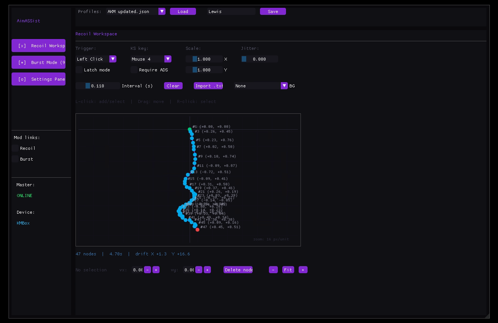
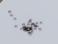
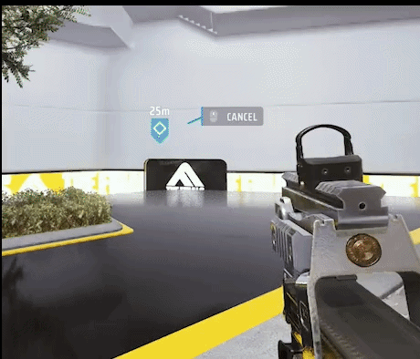

# AimASSist Control Workspace

An independent, low-latency client application built for the mentally retarded and physically disabled with [DearPyGui](https://github.com/hoffstadt/DearPyGui) for Dual-PC (2PC) topologies. This environment executes entirely on a secondary stream/control machine, routing mouse translation coordinates and click sequences directly to a physical KMBox processing unit over UDP.

By offloading the entire execution environment, configuration tables, and input pooling tasks, the script completely isolates execution signatures from the target gaming PC, rendering it **almost** entirely invisible to input heuristics. 

Originally configured for the specific frame pacing and recoil mechanics of *The Finals*, the software layer is built using an open device abstraction layer, allowing seamless adaptability for any competitive first-person shooter environment.

> [!IMPORTANT]
> The finals is filled with cheats so you might as well join in. Huge shoutout to the "pillars of the finals community" and **"Embark Partners"** who cheat & stream on twitch with a dma setup @lycommit and his cheater trio stack. larp harder loser! dia+ is like half cheaters LMAO

---
### GUI Design
 []()
 []()m11 @25m

 []()xp54 @25m

 []() lewis @20m
 
 []()


## Prerequisites & Initial Provisioning

- A Kmbox B/Net | Makcu/arduino
- A laptop or miniPC

### Host Environment Requirements

The host environment requires a standard **Python 3.10+** execution shell. Provision the baseline graphic framework and low-level system listener modules before runtime initialization:

```bash
pip install dearpygui keyboard
```

### Module File Layout

To ensure proper workspace linkage, the native target link-layer module corresponding to your network hardware (`kmNet`) must reside directly within the immediate directory structure:

```
|Recoil_processor| 
├── run_extractor.py # AiO tool for generating recoil patterns
├── inputs/image.png
├── outputs/weaponname_profile.txt

|AimASSist|
├── configs/           # Serialized JSON configuration profiles
├── kmNet.pyd          # Native hardware interface abstraction binary
└── master_control.py  # Primary runtime interface and worker engine
```

---

## Workspace Features

### Vector Recoil Matrix

- **Visual Trajectory Node Canvas** - Plot, test, and dynamically scale custom multi-node movement patterns directly onto the coordinate grid system. ADDING SOON
- **Focal-Length Speed Scaling** - Real-time evaluation coefficients calculate field-of-view (FOV) shifts, normalizing translation speeds instantly the millisecond you transition into aim down sights (ADS).
- **Target Constraint Verification** - Standalone validation toggles enforce strict runtime barriers, preventing macro activation unless target input thresholds are actively verified (e.g., ignoring pull vectors during hip-fire actions).

### Burst & Timing Module

*   **High-Precision Timing** - Uses hardware-level reference counters (`time.perf_counter`) to hit exact timing cycles, ensuring perfect intervals (like an exact 60ms delay between burst-fire bullets) without skipping a beat.
*   **Flexible Trigger Modes** - Swap between standard "hold-to-fire" mechanics or a "click-to-toggle" mode (click once to start firing, click again to stop).

### Calibration & Variable Parameters

1.  **In-Game Sensitivity** - Enter your exact hip-fire sensitivity so the script maps its pixel movements correctly.
2.  **ADS Zoom Multiplier** - Define your zoom ratio. If your in-game ADS sensitivity is set to 75%, simply input `0.75`.
3.  **Field of View (FOV)** - Match your in-game FOV to ensure the translation math remains perfectly accurate.
4.  **Hardware Killswitch** - Map a mouse button (e.g., `Mouse 5`) to instantly kill or wake the device's hardware inputs.
5.  **Panic Key** - Map a local keyboard hotkey (e.g., `/`, foot pedals, a controller paddle etc) as a background safety override to instantly pause the entire framework across the dual-PC setup.

## Notes
> [!IMPORTANT]
> **Anybrain Detection Vectors:** Modern competitive titles are shifting toward server-side AI profiling systems like Anybrain. Unlike traditional kernel-level anti-cheats that scan local system memory for cheat signatures, Anybrain operates entirely on the server side via game telemetry APIs.

### How Behavioral AI Works

* **Mouse Biometrics:** The AI processes raw mouse coordinates to analyze velocity, acceleration curves, and microscopic hand tremors. It looks for natural physiological fluctuations caused by human muscle fatigue or reaction lag.
* **Keystroke Dynamics:** It monitors the exact millisecond hold-times of keys and the timing gaps between inputs to detect unnatural consistency. (mouse clicks not being random will ban u within 1-2 games. mouse move is fine)
* **Pattern Profiling:** The platform establishes a baseline behavioral model for your account. If your mouse trajectories suddenly switch to mathematically rigid linear curves, the cloud engine flags the inputs as automated anomalies.

### Impact on Hardware Emulation

Using a Dual-PC setup or a physical KMBox completely hides your local code signature, but it does not protect your gameplay from server-side behavioral profiling. If your script inputs are too perfect or lack humanized smoothing filters, Anybrain will flag the account based entirely on the mechanical output sent to the server.

---

## Disclaimer and Liability

> [!WARNING]
> This software is strictly for educational, research, and personal testing purposes.
> 
> **By downloading, installing, or executing this software, you agree to the following terms:**
> * **Use At Your Own Risk:** The authors and contributors assume absolutely no liability for any account bans, temporary suspensions, or hardware restrictions (such as HWID bans) issued by game developers or anti-cheat providers.
> * **No Guarantees:** While this workspace utilizes hardware emulation and a Dual-PC setup to maximize isolation, no software or hardware automation layer is entirely undetectable. Anti-cheat heuristics change constantly. You are responsible for any outcomes.
> * **Compliance:** You are entirely responsible for reading and understanding the Terms of Service (ToS) of any game you run alongside this tool. 
> 
> This project is provided "as is" without warranty of any kind, express or implied. In no event shall the copyright holders or contributors be liable for any claim, damages, or other liability arising from the use of this software.